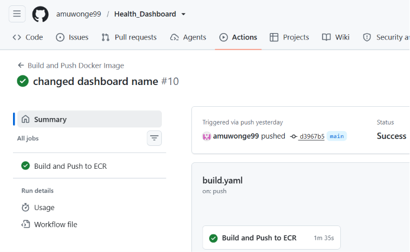
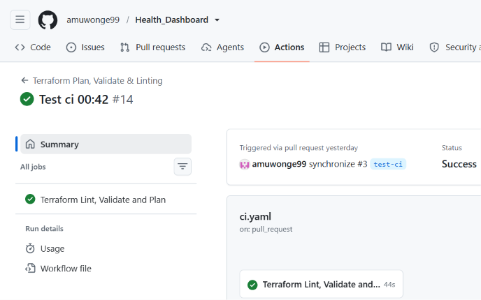
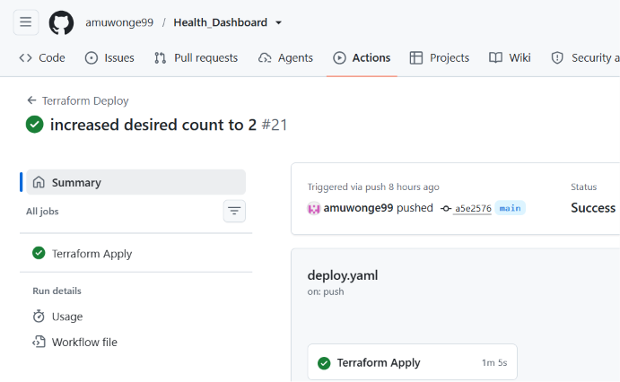
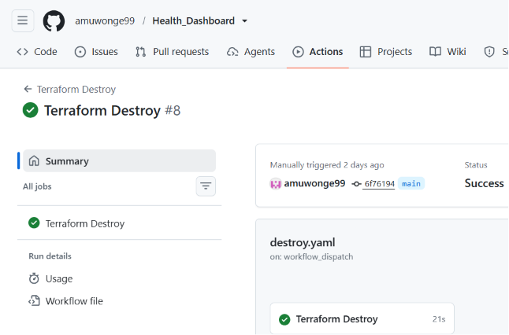

# Gatus Health Dashboard

**(Temporarily) Live URL:** [https://tm.gus-threat-modelling-tool.com](https://tm.gus-threat-modelling-tool.com)

---

## Table of Contents

- [Project Overview](#project-overview)
- [Tech Stack](#tech-stack)
- [Architecture Diagram](#architecture-diagram)
- [Demo](#demo)
- [Project Structure](#project-structure)
- [Local Setup](#local-setup)
- [Infrastructure](#infrastructure)
- [CI/CD Pipelines](#cicd-pipelines)
- [Pipeline Screenshots](#pipeline-screenshots)
- [HTTPS and DNS](#https-and-dns)
- [Security](#security)
- [Issues I Came Across](#issues-i-came-across)
- [Potential Improvements](#potential-improvements)

---

## Project Overview

Gatus is an open-source, Go-based uptime and health monitoring tool. This project containerises Gatus and deploys it to AWS ECS Fargate via modular Terraform with four decoupled CI/CD pipelines. The infrastructure is organised into three isolated environments (dev, test, prod), each with its own Terraform state and variable file, all sharing the same reusable module set. Changes can be validated in dev and test beofre being applied to production. The result is a live uptime dashboard served over HTTPS on a custom domain, with infrastructure and deployments fully reproducible from code.

---

## Tech Stack

- **Containerisation:** Docker (multi-stage build, `scratch` runtime, non-root user)
- **Infrastructure as Code:** Terraform (modular, remote S3 backend with native state locking)
- **Compute:** AWS ECS Fargate
- **Networking:** Custom VPC, public/private subnets, NAT Gateway, Application Load Balancer
- **DNS/TLS:** Cloudflare (DNS), AWS Certificate Manager (TLS, provisioned via Terraform)
- **CI/CD:** GitHub Actions with OIDC (no static AWS credentials)
- **Security scanning:** Trivy (container images), Checkov (Terraform), tflint (Terraform linting)
- **Registry:** Amazon ECR

---

## Architecture Diagram


**Request flow:**

```
User → Cloudflare DNS → Application Load Balancer (443/HTTPS)
     → Target Group → ECS Fargate tasks (private subnets, 2x AZ)
```

**Key design decisions:**

| Decision | Reasoning |
|---|---|
| ECS Fargate over EC2 | No host management overhead; serverless |
| Private subnets + NAT Gateway | ECS tasks have no public IP; only inbound access via NAT Gateway |
| `desired_count = 2` across 2 AZs | Increased redundancy; one task/AZ failure doesn't take the app down |
| ECS Auto Scaling (min 2, max 4) | Tasks scale out at ≥70% CPU, scale in at ≤20% CPU |
| `scratch` base Docker image | Minimal attack surface, lighter image |
| Cloudflare-validated ACM cert | Domain registered via Cloudflare, cert validation happens via API token |
| Route 53 hosted zone (provisioned, not authoritative) | Created for potential future migration |

---

## Demo


---

## Project Structure

```
.
├── .github/
│   └── workflows/
│       ├── build.yaml      # Build, Trivy scan, push image to ECR
│       ├── ci.yaml         # Terraform fmt, validate, tflint, checkov, plan (on PR)
│       ├── deploy.yaml     # Terraform apply + health check (on merge to main)
│       └── destroy.yaml    # Terraform destroy (manual trigger only)
├── app/
│   ├── Dockerfile          # Multi-stage build, clones Gatus source, scratch runtime
│   ├── .dockerignore
│   └── config/
│       └── config.yaml     # Gatus monitoring endpoint configuration
├── infra/
│   ├── environments/
│   │   ├── dev/            # Dev environment (isolated state, own tfvars)
│   │   │   ├── main.tf
│   │   │   ├── variables.tf
│   │   │   ├── outputs.tf
│   │   │   ├── provider.tf
│   │   │   └── dev.tfvars
│   │   ├── test/           # Test environment (isolated state, own tfvars)
│   │   │   ├── main.tf
│   │   │   ├── variables.tf
│   │   │   ├── outputs.tf
│   │   │   ├── provider.tf
│   │   │   └── test.tfvars
│   │   └── prod/           # Production environment
│   │       ├── main.tf
│   │       ├── variables.tf
│   │       ├── outputs.tf
│   │       ├── backend.tf
│   │       ├── provider.tf
│   │       ├── .terraform.lock.hcl
│   │       └── terraform.tfvars  # gitignored - not committed
│   └── modules/
│       ├── vpc/             # VPC, public/private subnets, NAT Gateway, route tables
│       ├── ecr/             # ECR repository & lifecycle policy
│       ├── acm/             # ACM certificate, Cloudflare DNS validation
│       ├── alb/             # Application Load Balancer, listeners, target group
│       ├── ecs/             # ECS cluster, task definition, service, IAM roles, autoscaling
│       └── dns/             # Route 53 A record (alias to ALB)
├── project_evidence/        # Screenshots, architecture diagram & gif
├── .gitignore
└── README.md
```

---

## Local Setup

**Prerequisites:** Docker

```bash
# Clone the repository
git clone https://github.com/amuwonge99/Health_Dashboard.git
cd Health_Dashboard

# Build the image (Dockerfile clones Gatus source at build time)
docker build -t gatus ./app

# Run it
docker run -p 8080:8080 gatus
```

Verify:

```bash
curl http://localhost:8080/health
# {"status":"UP"}
```

Open `http://localhost:8080` in a browser to see the Gatus dashboard.

---

## Infrastructure

- Custom VPC with 2 public and 2 private subnets (across 2 Availability Zones)
- Internet Gateway (public subnet egress) and NAT Gateway (private subnet egress)
- ECS Fargate cluster, task definition, and service (`desired_count = 2`)
- ECS Service Auto Scaling — step scaling policies triggered by CloudWatch CPU alarms (scale out at ≥70%, scale in at ≤20%)
- Application Load Balancer with HTTP→HTTPS redirect
- ACM wildcard certificate, created and DNS-validated entirely through Terraform
- ECR repository with image scan-on-push and lifecycle policy
- Route 53 hosted zone and A record (alias to ALB)
- IAM roles scoped to least privilege for ECS task execution and GitHub Actions OIDC

**ECS module variables** — task CPU, memory, log retention, and AWS region are all parameterised with sensible defaults, allowing different environments to override values without modifying the module:
 
 
```hcl
variable "task_cpu"           { default = "256" }
variable "task_memory"        { default = "512"  }
variable "log_retention_days" { default = 7      }
```
 
The ECS service uses `lifecycle { ignore_changes = [desired_count] }` so Terraform does not override the task count that autoscaling has set at runtime.

**Remote state:**

- S3 backend, versioned and encrypted
- Native S3 state locking (`use_lockfile = true`) — no separate DynamoDB table required

```hcl
terraform {
  backend "s3" {
    bucket       = "gatus-terraform-state-044260499053"
    key          = "prod/terraform.tfstate"
    region       = "eu-west-2"
    encrypt      = true
    use_lockfile = true
  }
}
```

---

## CI/CD Pipelines

Four decoupled pipelines, each with a single responsibility:

| Pipeline | Trigger | Purpose |
|---|---|---|
| `build.yaml` | Push to `main` (changes in `app/`) | Build Docker image, scan with Trivy, push to ECR tagged with commit SHA and `latest` |
| `ci.yaml` | Open pull request to `main` from a feature branch | `terraform fmt -check`, `validate`, `tflint`, `checkov`, `terraform plan` |
| `deploy.yaml` | Merge pull request onto `main` | `terraform apply`, then a post-deploy HTTPS health check against the live URL |
| `destroy.yaml` | Manual (`workflow_dispatch` only) | `terraform destroy` - never triggered by a push, to avoid accidental teardown |

All AWS authentication uses **OIDC** — no static AWS access keys are stored anywhere in GitHub.

---

## Pipeline Screenshots

| Pipeline | Status |
|---|---|
| Build and Push Docker Image |  |
| Terraform Plan, Validate & Linting |  |
| Terraform Apply |  |
| Terraform Destroy |  |

---

## HTTPS and DNS

- TLS termination at the ALB using a wildcard ACM certificate (`*.gus-threat-modelling-tool.com`)
- Certificate is created **and validated** entirely via Terraform, using the `cloudflare` provider to create the DNS validation record
- HTTP (port 80) automatically redirects to HTTPS (port 443)
- A Route 53 hosted zone exists and is Terraform-managed, but **Cloudflare remains the domain's authoritative DNS**
- The `tm` CNAME in Cloudflare is set to **DNS only** (not proxied), so TLS terminates at the ALB rather than at Cloudflare's edge

---

## Security

- ECS tasks run in **private subnets** with no public IP
- Security groups scoped tightly: ALB allows 80/443 from anywhere, ECS only allows 8080 from the ALB's security group
- Docker image built from `scratch` - no shell, no package manager, minimal attack surface
- Container runs as a **non-root user**
- GitHub Actions authenticates to AWS via **OIDC**, eliminating static credentials
- **Trivy** scans the Docker image for HIGH/CRITICAL CVEs on every build
- **Checkov** scans Terraform for security misconfigurations on every pull request
- **tflint** catches Terraform linting issues before merge
- No secrets committed to the repository — `terraform.tfvars` and `.terraform/` are gitignored; all CI/CD secrets are stored in GitHub Actions secrets

---

## Issues I Came Across

**Issue 1**: Go version mismatch.
The Dockerfile I used from the cloned Gatus repository used golang:1.23-alpine but Gatus go.mod required Go >= 1.26.3.

**Fix**: I updated my Dockerfile to FROM golang:1.26-alpine AS builder.

**Issue 2**: Running as root in scratch image.
The scratch image had no user management so the container defaulted to running as root.

**Fix**: I created an underprivileged user named "nobody" and ran the container as them in the build stage.

**Issue 3**: ECS task failing to pull image.
ECS service deployment failed with CannotPullContainerError - image not found.

**Fix**: Initial image was pushed with a git SHA tag only. So I added a latest tag and pushed.

**Issue 4**: SSL certificate mismatch.
The curl returned an SSL error: "no alternative certificate subject name matches target host name 'tm.gus-threat-modelling-tool.com' ".

**Fix**: The ACM certificate was issued for the root domain gus-threat-modelling-tool.com but I was attempting to access the app at tm.gus-threat-modelling-tool.com. I requested a new wildcard certificate for *.gus-threat-modelling-tool.com and updated the ALB HTTPS listener to use it.

**Issue 5**: Having to re-clone Gatus source every time.
Every time the project was set up fresh, the Gatus source code had to be manually cloned into app/ before docker build would work.

**Fix**: I moved the git clone into the Dockerfile so Docker fetches the source at build time

**Issue 6**: Old git history attached to new repo.
After creating a new GitHub repo, the old git history was still attached locally causing conflicts.

**Fix**: I removed the .git directory then reinitialised

---

## Potential Improvements

**Transfer domain to Route 53**. My domain was registered within Cloudflare's 60-day transfer lock window. Once the window passes, I could give full DNS delegation to Route 53, which would eliminate the split-provider setup.

**WAF (Web Application Firewall) on ALB**. My checkov scan flagged me having a public ALB without a WAF. A WAF would provide protection against common web attacks, however it carries an additional cost.